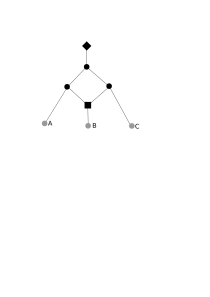

% PyCuda Tree-Child
% Remie Janssen
% September 22, 2005

# Background

## Phylogenetic network

::: {.columns}
:::: {.column width="50%}

- Directed acyclic graph
- Single root (in-0, out-1)
- Labeled leaves (in-1, out-0)
- Tree nodes (in-1, out-2)
- Reticulations (in-2, out-1)

::::
:::: {.column width="50%}

::::
:::

## Tree child network
::: {.columns}
:::: {.column width="50%}

 - Class of networks
 - Computationally favorable structure
 - "each non-leaf node has at least one tree-node as successor"
 - Equivalently: No stacks of reticulations and no W-shapes

::::
:::: {.column width="50%}

::::
:::

# Implementation

## PyCuda

- Cuda wrapper for Python
- Still have to write device/global cuda code
- Implicit Memcpy using numpy data formats
- Cuda code in .cu file, loaded in python

## GPU Graph encoding
::: {.columns}
:::: {.column width="50%}

- Graph: in array
- Nodes: non-negative ints
- in- and out-neighbours per node
- "-1" for non-neighbour (here "-")

::::
:::: {.column width="50%}

::::
:::
## GPU code

- Each thread checks one node
- Check whether it is a leaf
- Check if it has any tree-node children
- If not as leaf, and no tree-node children, set output to "not tree-child"

# Results

## Results
::: {.columns}
:::: {.column width="50%}

- GPU: Fairly constant running time
- CPU: Running time increases with n, and decreases with k
- CPU stops when it finds a stack or W-shape
- As expected: GPU only useful for huge networks with few reticulations
- May be useful for other phylogenetic network problems though

::::
:::: {.column width="50%}

::::
:::
